# PEMOGRAMAAN WEB

Dean Adriansyah Asy'ari (312110286)

Teknik Informatika - UNIVERSITAS PELITA BANGSA
______________________________________________

## MELAKUKAN INSTALL PADA XAMPP

Untuk dapat menginstall Xampp kalian dapat menggunakan link ini https://www.apachefriends.org/download.html pada google, dan kemudian setelah terbuka kalian dapat memilih beberapa versi yang sesuai dengan laptop kalian. Dan pilihlah versi portable untuk memudahkan terjadinya proses instalasi nantinya.

Setelah itu kalian dapat melakukan Extract File tersebut dengan menyesuaikan lokasi penyimpanannya seperti gambar dibawah.

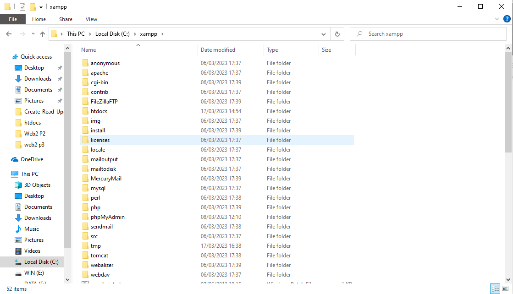


## PROSES MENJALANKAN XAMPP

Untuk dapat menjalankan Xampp ini kalian perlu membukanya terlebih dulu, setelah itu kalian klik tombol start pada bagian server Apache, dan tampilan utama Xampp seperti gambar dibaawah ini jika berhasil.

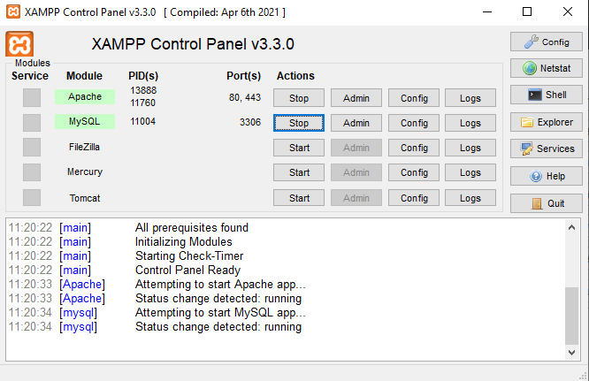


## MEMULAI PHP

Pertama, buatlah folder "Web2 p3" pada root directory web server (c:xampp/htdocs)

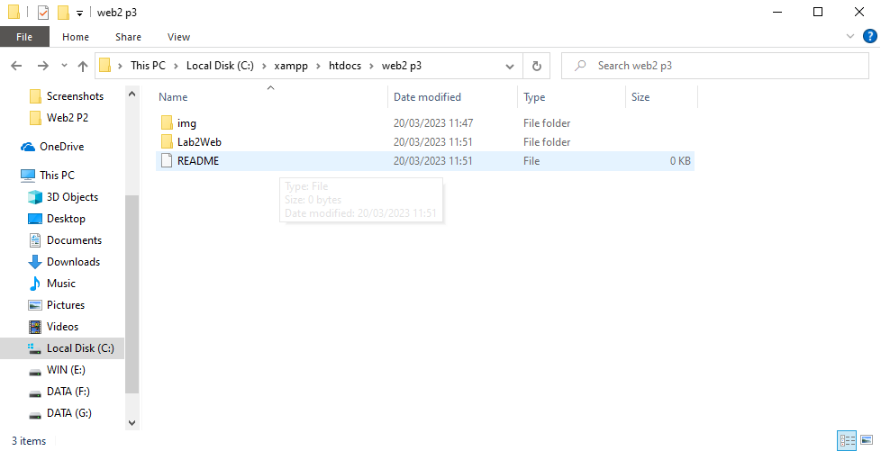

Setelahnya kalian dapat mengakses directory pada web server seperti gambar dibawah dengan menggunakan URL : http://localhost/Web2%20p3/Lab2Web/

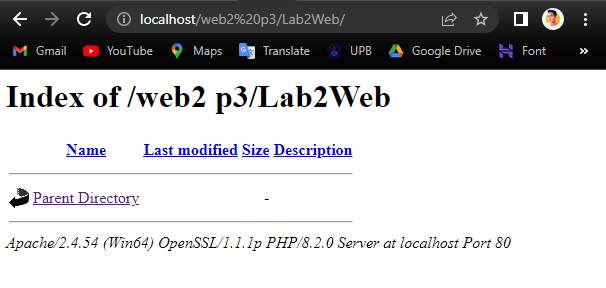


## PHP DASAR

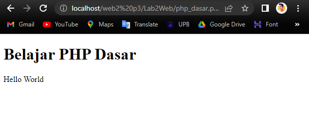

Untuk dapat mendapatkan tampilan seperti gambar diatas, buatlah file baru dengan nama php_dasar.php pada directory tersebut. Kemudian tambahkan kode berikut:

```php
<!DOCTYPE html>
<html lang="en">
<head>
    <meta charset="UTF-8">
    <title>PHP Dasar</title>
</head>
<body>
    <h1>Belajar PHP Dasar</h1>
    <?php
        echo "Hello World";
    ?>
</body>
</html>
```

## VARIABLE PHP

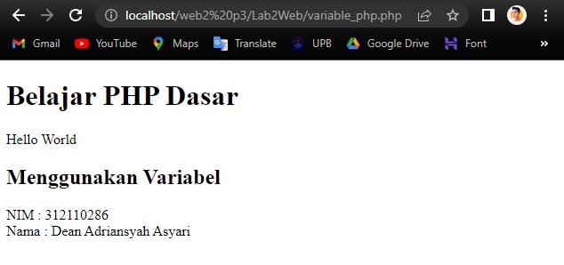

Untuk mendapatkan tampilan seperti diatas kalian bisa menambahkan kode berikut:

```php
<!-- Variabel PHP -->
<h2>Menggunakan Variabel</h2>
    <?php
        $nim = "312110286";
        $nama = 'Dean Adriansyah Asyari';
        echo "NIM : " . $nim . "<br>";
        echo "Nama : $nama";
    ?>
```

## PREDEFINE $_GET

Buatlah file baru dalam Directory Lab2Web dengan nama file disini saya namakan dengan predefine.php dan untuk mengaksesnya dapat menggunakan URL : http://localhost/Web2%20p3/Lab2Web/predefine.php/

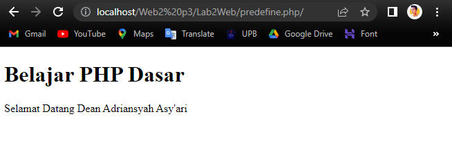

Berikut kode yang digunakan:

```php
<!DOCTYPE html>
<html lang="en">
<head>
    <meta charset="UTF-8">
    <meta http-equiv="X-UA-Compatible" content="IE=edge">
    <meta name="viewport" content="width=device-width, initial-scale=1.0">
    <title>PHP Dasar</title>
</head>
<body>
    <!-- Variabel $_GET -->
    <h2>Predefine Variabel</h2>
<?php
    echo 'Selamat Datang'. $_GET['nama'];
?>
</body>
</html>
```

## PEMBUATAN FORM INPUT DENGAN VARIABLE $_POST

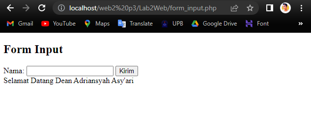

Untuk mendapat tampilan diatas, buatlah file baru dengan nama file disini saya namakan form_input.php dalam directory Lab2Web. Kemudian tambahkan kode berikut:

```php
<!DOCTYPE html>
<html lang="en">
<head>
    <meta charset="UTF-8">
    <title>PHP Dasar</title>
</head>
<body>
<h2>Form Input</h2>
<form method="post">
    <label>Nama: </label>
    <input type="text" name="nama">
    <input type="submit" value="Kirim">
</form>
<?php
    echo 'Selamat Datang ' . $_POST['nama'];
?>
</body>
</html>
```

## OPERATOR

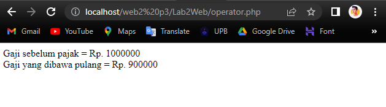

Untuk mendapat tampilan diatas, buatlah file baru dengan nama file disini saya namakan operator.php dalam directory Lab2Web. Kemudian tambahkan kode berikut:

```php
<!DOCTYPE html>
<html lang="en">
<head>
    <meta charset="UTF-8">
    <meta http-equiv="X-UA-Compatible" content="IE=edge">
    <meta name="viewport" content="width=device-width, initial-scale=1.0">
    <title>PHP Dasar</title>
</head>
<body>
<?php
    $gaji = 1000000;
    $pajak = 0.1;
    $thp = $gaji - ($gaji*$pajak);
        echo "Gaji sebelum pajak = Rp. $gaji <br>";
        echo "Gaji yang dibawa pulang = Rp. $thp";
?>
</body>
</html>
```

## KONDISI IF

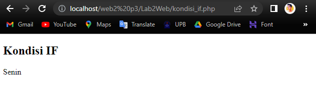

Untuk mendapat tampilan pengkondisian IF ELSE seperti diatas, buatlah file baru dengan nama file disini saya namakan kondisi_if.php dalam directory Lab2Web. Kemudian tambahkan kode berikut:

```php
<!DOCTYPE html>
<html lang="en">
<head>
    <meta charset="UTF-8">
    <meta http-equiv="X-UA-Compatible" content="IE=edge">
    <meta name="viewport" content="width=device-width, initial-scale=1.0">
    <title>PHP Dasar</title>
</head>
<body>
    <h2>Kondisi IF</h2>
<?php
    $nama_hari = date("l");
        if ($nama_hari == "Sunday") {
            echo "Minggu";
        } elseif ($nama_hari == "Monday") {
            echo "Senin";
        } else {
            echo "Selasa";
        }
?>
</body>
</html>
```

## KONDISI SWITCH

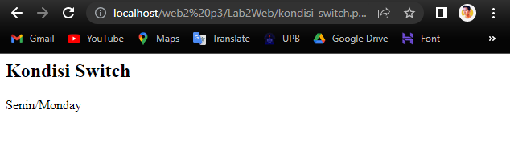

Untuk mendapat tampilan pengkondisian SWITCH CASE dengan break seperti diatas, buatlah file baru dengan nama file disini saya namakan kondisi_switch.php dalam directory Lab2Web. Kemudian tambahkan kode berikut:

```php
<h2>Kondisi Switch</h2>
<?php
    $nama_hari = date("l");
    switch ($nama_hari) {
        case "Sunday":
            echo "Minggu";
            break;
        case "Monday":
            echo "Senin";
            break;
        case "Tuesday":
            echo "Selasa";
            break;
        default:
            echo "Sabtu";
    }
    echo"/$nama_hari";
?>
```

## PERULANGAN FOR

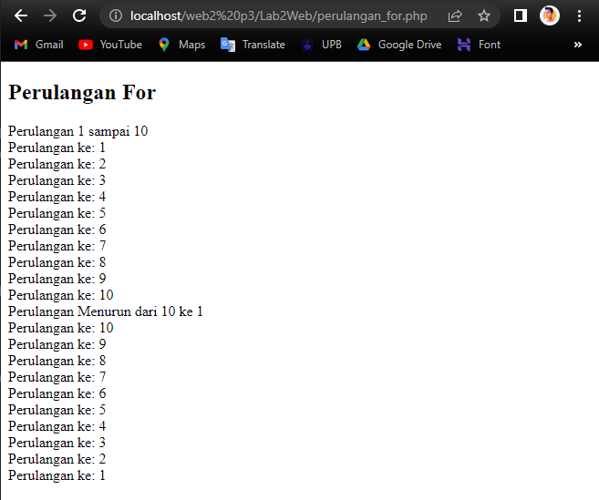

Untuk mendapat tampilan seperti diatas, buatlah file baru dengan nama file disini saya namakan perulangan_for.php dalam directory Lab2Web. Kemudian tambahkan kode berikut:

```php
<!DOCTYPE html>
<html lang="en">
<head>
    <meta charset="UTF-8">
    <meta http-equiv="X-UA-Compatible" content="IE=edge">
    <meta name="viewport" content="width=device-width, initial-scale=1.0">
    <title>PHP Dasar</title>
</head>
<body>
    <h2>Perulangan For</h2>
<?php
        echo "Perulangan 1 sampai 10 <br />";
    for ($i=1; $i<=10; $i++) {
        echo "Perulangan ke: " . $i . '<br />';
    }
        echo "Perulangan Menurun dari 10 ke 1 <br />";
    for ($i=10; $i>=1; $i--) {
        echo "Perulangan ke: " . $i . '<br />';
    }
?>
</body>
</html>
```

## PERULANGAN WHILE

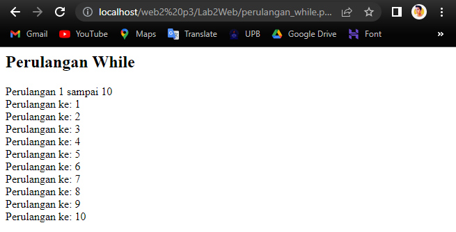

Untuk mendapat tampilan seperti diatas, buatlah file baru dengan nama file disini saya namakan perulangan_while.php dalam directory Lab2Web. Kemudian tambahkan kode berikut:

```php
<h2>Perulangan While</h2>
<?php
        echo "Perulangan 1 sampai 10 <br />";
        $i=1;
    while ($i<=10) {
        echo "Perulangan ke: " . $i . '<br />';
        $i++;
    }
?>
```

## PERULANGAN DOWHILE

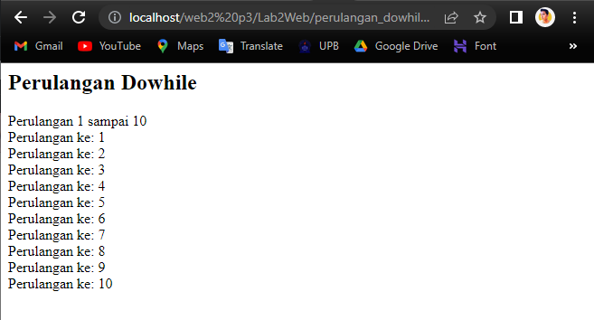

Untuk mendapat tampilan seperti diatas, buatlah file baru dengan nama file disini saya namakan perulangan_dowhile.php dalam directory Lab2Web. Kemudian tambahkan kode berikut:

```php
<h2>Perulangan Dowhile</h2>
<?php
        echo "Perulangan 1 sampai 10 <br />";
        $i=1;
    do {
        echo "Perulangan ke: " . $i . '<br />';
        $i++;
        } while ($i<=10);
?>
```

# PERTANYAAN DAN TUGAS

Buatlah program PHP sederhana dengan menggunakan form input yang menampilkan nama , tanggal lahir dan pekerjaan . Kemudian tampilkan outputnya dengan menghitung umur berdasarkan inputan tanggal lahir . Dan pilihan pekerjaan dengan gaji yang berbeda-beda sesuai pilihan pekerjaan.

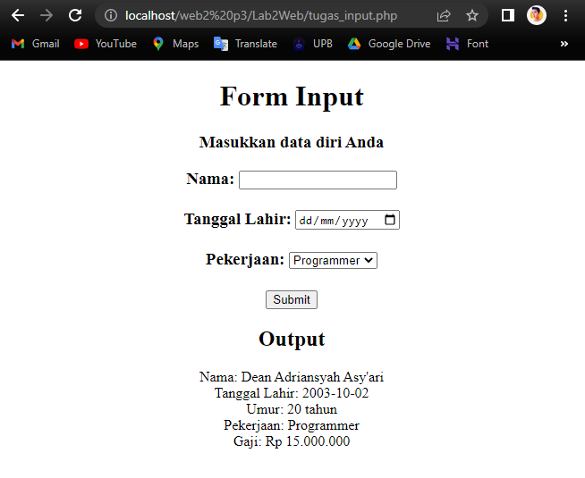

Note: Untuk kolom Tanggal Lahir gunakan format : 0000/00/00

```php
<!DOCTYPE html>
<html>
<head>
    <title>Program PHP Sederhana</title>
</head>
<body align=center>
    <h1>Form Input</h1>
    <h3>Masukkan data diri Anda<h3>
    <form method="post" action="<?php echo htmlspecialchars($_SERVER["PHP_SELF"]);?>">
        Nama: <input type="text" name="nama"><br><br>
        Tanggal Lahir: <input type="date" name="tgl_lahir"><br><br>
        Pekerjaan: 
        <select name="pekerjaan">
            <option value="Programmer">Programmer</option>
            <option value="Designer">Designer</option>
            <option value="Marketing">Marketing</option>
            <option value="Office Boy">Office Boy</option>
            <option value="Security">Security</option>
        </select><br><br>
        <input type="submit" name="submit" value="Submit">
    </form>

    <?php
        // Cek apakah form sudah di-submit
        if ($_SERVER["REQUEST_METHOD"] == "POST") {
            // Ambil nilai dari form
            $nama = $_POST["nama"];
            $tgl_lahir = $_POST["tgl_lahir"];
            $pekerjaan = $_POST["pekerjaan"];

            // Menghitung umur berdasarkan tanggal lahir
            $tgl_lahir_timestamp = strtotime($tgl_lahir);
            $umur = date("Y") - date("Y", $tgl_lahir_timestamp);

            // Menentukan gaji berdasarkan pekerjaan
            switch ($pekerjaan) {
                case "Programmer":
                    $gaji = 15000000;
                    break;
                case "Designer":
                    $gaji = 8000000;
                    break;
                case "Marketing":
                    $gaji = 6000000;
                    break;
                case "Office Boy":
                    $gaji = 2000000;
                    break;
                case "Security":
                    $gaji = 3500000;
                    break;
                default:
                    $gaji = 0;
                    break;
            }

            // Menampilkan output
            echo "<h2>Output</h2>";
            echo "Nama: " . $nama . "<br>";
            echo "Tanggal Lahir: " . $tgl_lahir . "<br>";
            echo "Umur: " . $umur . " tahun<br>";
            echo "Pekerjaan: " . $pekerjaan . "<br>";
            echo "Gaji: Rp " . number_format($gaji, 0, ",", ".") . "<br>";
        }
    ?>
</body>
</html>
```

# <P align="center"> THANK YOU SO MUCH FOR YOUR ATTENTION!! SEE YOU!!
